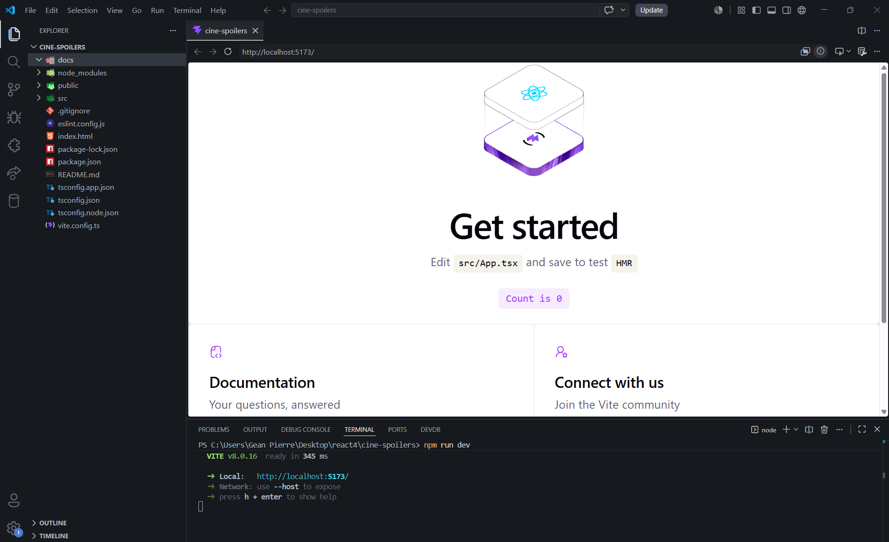
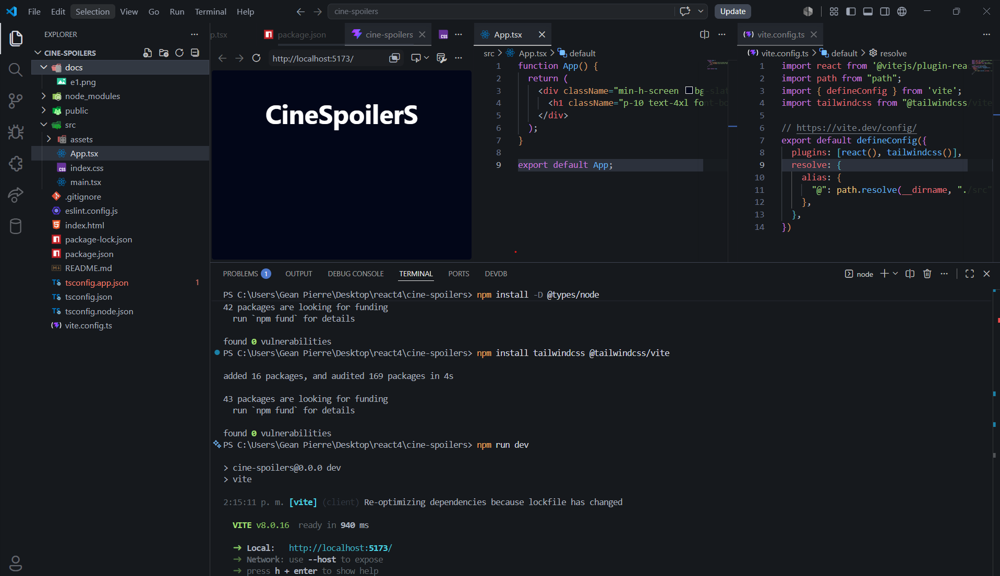
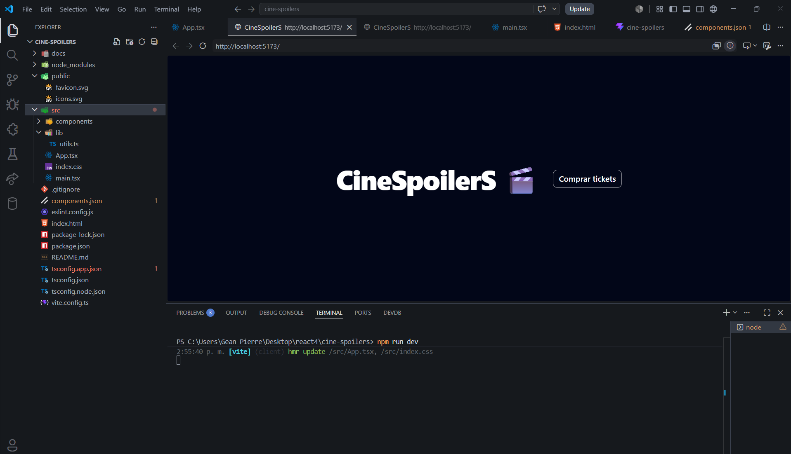
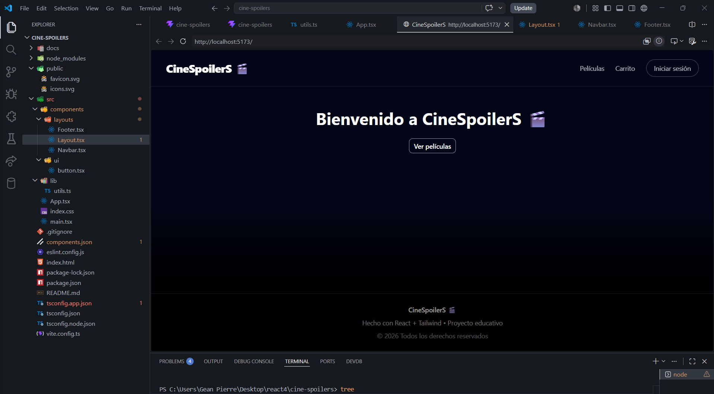
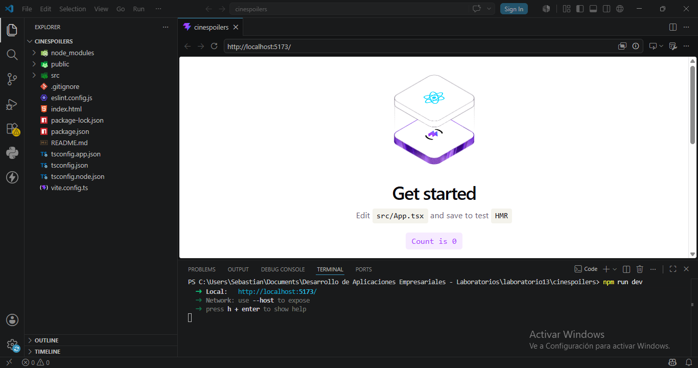
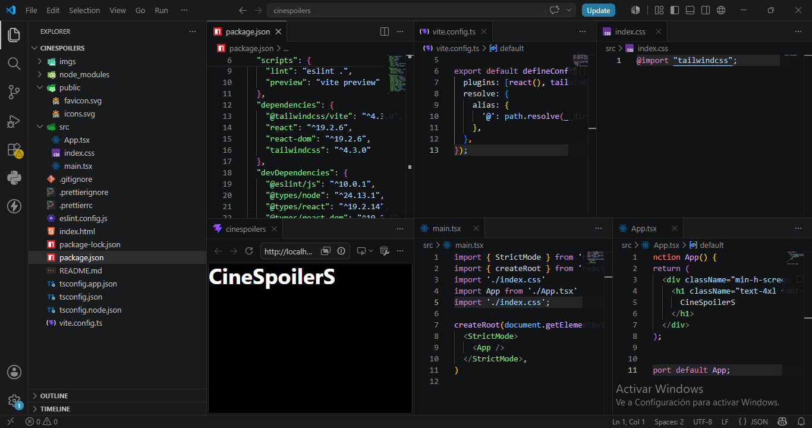
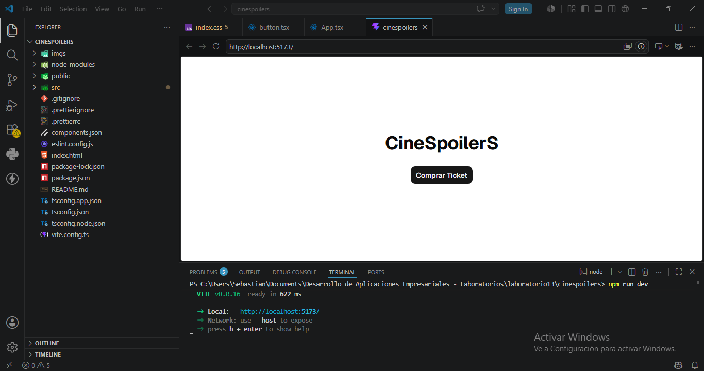
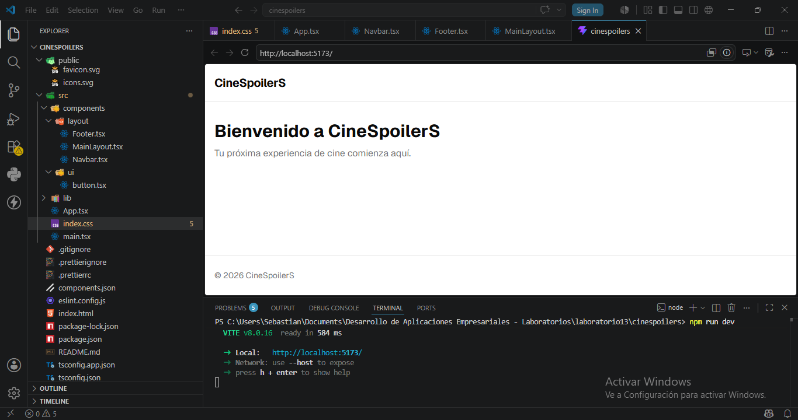
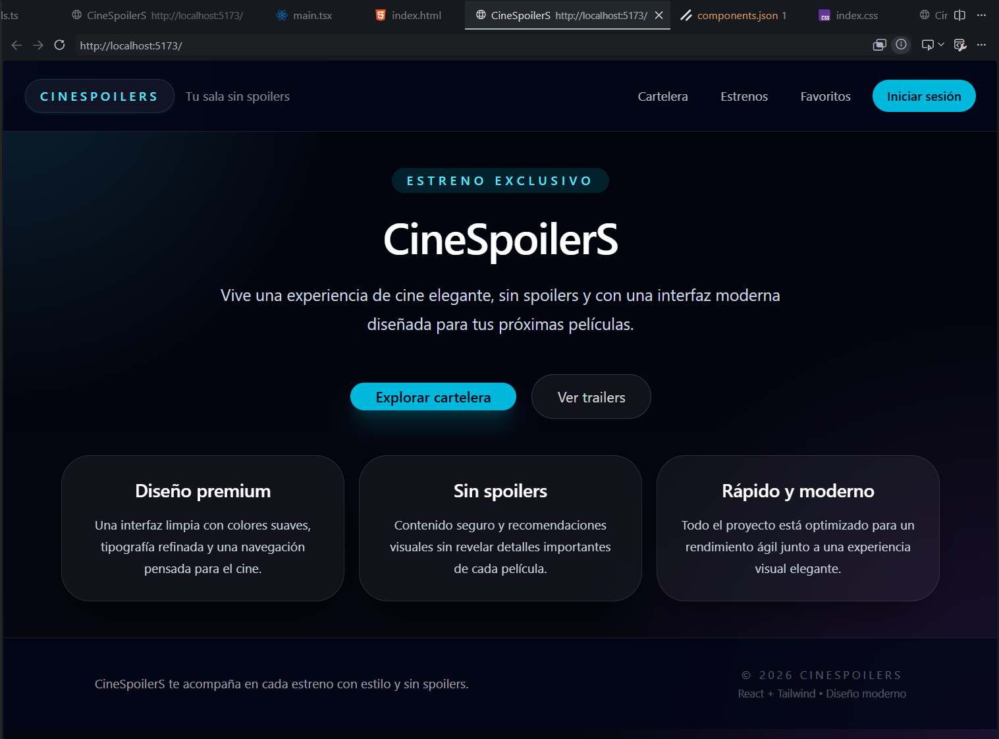

# 🎬 CineSpoilerS

Aplicación web de e-commerce básica de tickets de cine desarrollada con React + Vite + TypeScript.  
Este proyecto es una base escalable que simula una plataforma de compra de entradas de películas.

---

## 🚀 Tecnologías utilizadas

- React 19 + Vite
- TypeScript
- Tailwind CSS v4
- shadcn/ui
- Radix UI
- ESLint
- Git & GitHub
  
---

## 🧱 Características principales

- Layout profesional con Navbar y Footer
- Diseño oscuro tipo cine/streaming
- Componentes reutilizables (shadcn/ui)

---

## 📸 Evidencias del desarrollo

## Integrante 1 (Gean Pierre Ayala)

### 🧪 Etapa 1

### 🧪 Etapa 2

### 🧪 Etapa 3

### 🧪 Etapa 4

---

## Integrante 2 (Sebastian Salas Cordova)

### 🧪 Etapa 1

### 🧪 Etapa 2

### 🧪 Etapa 3

### 🧪 Etapa 4

---

## Integrante 2 (Yefry Calderon)

### 🧪 Etapa 4

